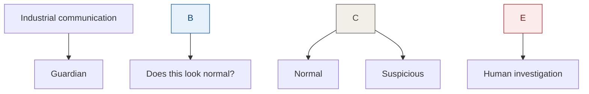
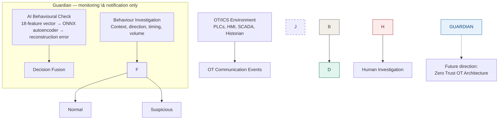
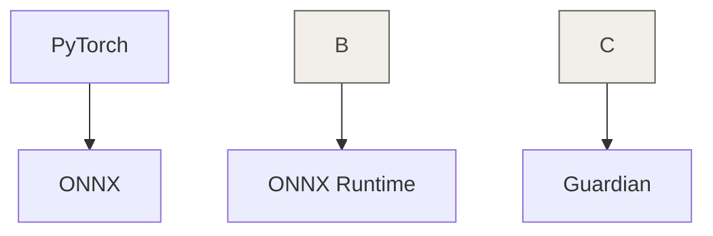
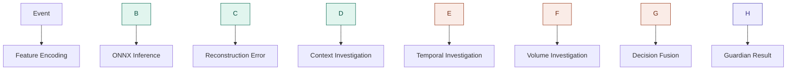
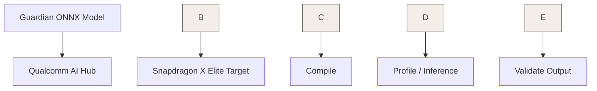
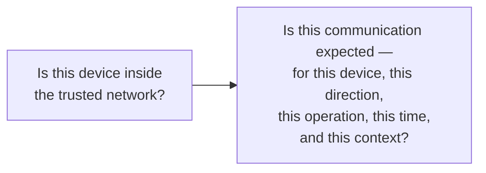

# Local AI Guardian


### Local AI-based behavioural security monitoring for OT/ICS environments

Local AI Guardian is a local-first OT/ICS security monitoring system designed to observe industrial communication behaviour, identify suspicious changes from normal behaviour, and provide useful information to a human operator without requiring continuous Internet connectivity.

The main idea is simple:

> \*\*Observe. Analyze. Explain. Alert — without interfering with the industrial process.\*\*

\---

# 1\. The Problem

In OT/ICS environments, Internet connectivity is often limited, with external connectivity typically concentrated around higher Purdue levels such as the DMZ/Level 3.5. This makes security practices that depend on continuous Internet connectivity, such as cloud-based monitoring, updates, patching and some antivirus workflows, more difficult to apply directly to industrial systems.

This creates a practical question:

> \*\*How can we continuously monitor OT/ICS communication for suspicious behavioural changes while keeping the monitoring local and without interfering with the industrial process?\*\*

This question led to the development of Local AI Guardian — a local, passive behavioural security monitor designed to observe OT/ICS communication, detect deviations from expected behaviour, and alert a human operator without automatically blocking traffic or modifying the industrial process.

\---

# 2\. What Guardian Does

Local AI Guardian works as a **passive observer** of communication behaviour in an OT/ICS environment.

It receives information about communication events, such as:

1. Source device
2. Destination device
3. Communication direction
4. Operation/information type
5. Protocol
6. Port
7. Timestamp
8. Message size

Guardian compares new communication behaviour with the behaviour that was established as normal. It uses two main types of checks.

### AI-based behavioural check

A lightweight autoencoder looks at the communication features and calculates how well the model can reconstruct them. If the reconstruction error is higher than the established threshold, the AI considers the communication behaviour unusual.

### Behaviour investigation

Guardian also checks the communication itself. It asks questions such as:

1. Is this source and destination relationship known?
2. Is the communication direction expected?
3. Is this operation known for this communication?
4. Is the protocol expected?
5. Is the communication happening at an unusual time?
6. Is the communication volume unusual?

The results of these checks are combined before Guardian produces its final assessment. If the behaviour appears suspicious, Guardian does not automatically block it. Instead, it provides evidence and an explanation so that a human operator or security analyst can investigate.

### In simple terms



*(Diagram above is a Mermaid code block — edit the text directly to relabel or reshape it.)*

Guardian is therefore intended to be a **security assistant**, not an automatic controller of the industrial environment.

\---

# 3\. Architecture

Guardian sits alongside the OT/ICS environment as a passive observer. It never sits inline in the communication path, and it never blocks or changes traffic — it only watches, reasons, and reports. The diagram below lays out the full pipeline, from the industrial devices on the left through to the human operator who reviews anything Guardian flags.



*(This is a Mermaid flowchart, kept as plain text inside a code fence — GitHub, GitLab, Notion, Obsidian and most Markdown viewers render it automatically. To change a label, box, or connection, just edit the text between the ````mermaid` and ````` markers.)*

Guardian never blocks traffic, controls a PLC, or changes the industrial process — see **§ 11 Safety Boundary** for the full list of what Guardian can and cannot do.

\---

# 4\. How Guardian Detects Suspicious Behaviour

Guardian does not depend on only one signal. The current system combines several checks.

### AI anomaly detection

The communication event is converted into an 18-feature vector. The ONNX autoencoder reconstructs the vector and Guardian calculates the reconstruction error.

The validated threshold is:

`0.0010467613755015663`

A reconstruction error above this threshold is treated as an AI anomaly.

### Context checks

Guardian checks whether the communication fits the known environment. This includes:

1. Known device relationship
2. Known direction
3. Known operation/information
4. Expected protocol and port

### Temporal check

Guardian checks whether the timing of communication is consistent with the established behaviour.

### Volume check

Guardian checks whether the communication volume is within the expected range.

### Decision fusion

These signals are combined into the final Guardian assessment. This is important because an unusual AI score by itself does not automatically mean that an attack has happened. The purpose of the combined checks is to provide more useful evidence for human investigation.

\---

# 5\. Repository Structure

1. `Local-AI-Guardian/`

   1. `README.md`
   2. `LICENSE`
   3. `requirements.txt`
   4. `.gitignore`
   5. `src/`

      1. `guardian.py`
   6. `models/`

      1. `guardian\_autoencoder.onnx`
   7. `notebooks/`

      1. `OT\_Guardian\_PyTorch\_Deployment.ipynb`
   8. `data/`

      1. `sample\_events.json`
   9. `docs/`

      1. `development\_transparency.md`

### Main components

|Component|Purpose|
|-|-|
|`src/guardian.py`|Runtime Guardian logic|
|`models/guardian\_autoencoder.onnx`|Deployed autoencoder|
|`notebooks/`|Development and deployment validation|
|`data/`|Sample OT communication events|
|`docs/`|Additional project documentation|
|`README.md`|Main project documentation|

\---

# 6\. Model Information

The AI component of Guardian is a lightweight autoencoder used for behavioural anomaly detection. The model was developed using PyTorch and exported to ONNX for deployment.

The deployed model is:

`models/guardian\_autoencoder.onnx`

### Input

Guardian converts an OT communication event into an **18-feature vector**. The feature representation contains information about:

1. Source
2. Destination
3. Information/operation
4. Protocol/port

### Output

The autoencoder reconstructs the input vector. Guardian calculates the reconstruction error between the original vector and the reconstructed vector:

*Reconstruction Error = mean((output − input)²)*

### Runtime threshold

The validated threshold is:

`0.0010467613755015663`

This threshold is part of the validated runtime behaviour and is not recalculated during normal inference.

### Deployment



The runtime therefore uses the deployed ONNX model instead of requiring the original training environment.

\---

# 7\. Runtime Requirements

The current runtime requires Python and the following main runtime packages:

1. `numpy`
2. `onnxruntime`

The project keeps the final runtime separate from the model-development environment. Training and deployment experiments do not need to be repeated when running the deployed Guardian model.

\---

# 8\. Installation

1. Clone the repository and move into the project folder (repository URL: `<repository-url>`, folder name: `Local-AI-Guardian`).
2. Install the required packages listed in `requirements.txt`.
3. Confirm the ONNX model is present at `models/guardian\_autoencoder.onnx`.
4. Keep the repository structure unchanged so Guardian can locate the model correctly.

\---

# 9\. Running Guardian

Guardian exposes its analysis capability through a single entry point, `analyze\_event`, described here as a step-by-step algorithm rather than as pasted code:

1. Import Guardian's analysis function from the runtime module.
2. Build a communication event describing: source device, destination device, operation/information type, protocol, port, timestamp, and message size.
3. Pass the event to Guardian for analysis.
4. Guardian encodes the event into feature representation.
5. Guardian runs ONNX inference and calculates the reconstruction error.
6. Guardian investigates context, timing, and volume in parallel.
7. Guardian fuses the AI result and the investigation result into one decision.
8. Guardian returns a structured result and a human-readable explanation.



\---

# 10\. Example Input / Output

### Example event

1. Source: `HMI-01`
2. Destination: `PLC-01`
3. Operation: `process\_read`
4. Protocol: `Modbus/TCP`
5. Port: `502`
6. Timestamp: `145 seconds`
7. Message size: `180 bytes`

### Example result

**\[INSERT SCREENSHOT OF ACTUAL GUARDIAN OUTPUT HERE]**

Screenshot should show:

1. Guardian result: `NORMAL`
2. Reconstruction error
3. Guardian threshold
4. AI anomaly status
5. Context anomaly status
6. Temporal anomaly status
7. Volume anomaly status
8. Communication context
9. Human recommendation

There is no need to capture the entire terminal output if the important information can be shown clearly in one screenshot.

\---

# 11\. Safety Boundary

Local AI Guardian is intentionally designed as a **monitoring and notification system**.

### Guardian can:

1. Observe OT communication behaviour
2. Analyse communication events
3. Detect deviations from the baseline
4. Investigate communication context
5. Investigate timing
6. Investigate communication volume
7. Provide evidence
8. Notify a human operator or analyst

### Guardian does not:

1. Block network traffic
2. Modify PLC configuration
3. Modify the industrial process
4. Shut down equipment
5. Control OT devices
6. Automatically take corrective action

|Capability|Guardian|
|-|:-:|
|Observe|YES|
|Analyse|YES|
|Investigate|YES|
|Explain|YES|
|Alert|YES|
|Block traffic|NO|
|Control PLC|NO|
|Change process|NO|
|Automatic action|NO|

This boundary is intentional. The security system should not become another source of operational risk.

\---

# 12\. Validation \& Deployment Evidence

The project was tested using the actual deployed ONNX model and the runtime source used by Guardian.

## Runtime validation

**\[INSERT SCREENSHOT HERE]**

This screenshot should show:

1. The actual Guardian runtime successfully running with `guardian\_autoencoder.onnx`
2. A known-normal HMI-01 → PLC-01 communication
3. Reconstruction error
4. Guardian threshold
5. Final `NORMAL` result

The validated example produced:

|Metric|Value|
|-|-|
|Reconstruction error|0.000231|
|Guardian threshold|0.001047|
|Result|NORMAL|

The contextual, temporal and volume checks also reported no anomaly.

## ONNX / deployment validation

**\[INSERT SCREENSHOT HERE]**

1. This screenshot should show the important ONNX validation result from the deployment notebook, rather than a screenshot of the entire notebook.

The purpose is to demonstrate that the exported ONNX model can be loaded and used for inference successfully.

## Snapdragon validation

**\[INSERT SCREENSHOT HERE]**

1. This screenshot should show the important Qualcomm AI Hub / Snapdragon validation result, such as the target model execution, profiling or inference result.

Only the useful evidence needs to be shown. The entire notebook does not need to be captured.

\---

# 13\. Snapdragon Deployment

The deployment workflow was also tested against a Snapdragon X Elite target through Qualcomm AI Hub.



The deployment notebook contains the corresponding deployment and validation steps.

The project should be described as **Snapdragon-targeted and deployment-validated through the Qualcomm workflow**. It should not claim physical deployment on a Snapdragon laptop that was not available during development.

The normal Guardian runtime does not require continuous Internet access. Qualcomm AI Hub is part of the development and deployment validation workflow.

\---

# 14\. Current Limitations

Local AI Guardian is currently a prototype. The current system was developed and tested using a controlled OT/ICS environment rather than a live industrial plant. Therefore, the current model should not be treated as a model that already understands every industrial environment.

Current limitations include:

1. Controlled demonstration environment
2. Limited set of devices and communication behaviours
3. Limited feature representation
4. Limited OT protocol coverage
5. No live industrial network integration
6. No complete Zero Trust implementation
7. No automatic response
8. No physical process control
9. No claim of replacing an existing OT security platform

A real industrial deployment would require plant-specific validation and a much larger range of normal and abnormal behaviour.

\---

# 15\. Future Scope

The current Guardian is the first stage of a larger idea. Possible future development includes:

1. **Live OT network monitoring** — Connect Guardian directly to suitable OT network telemetry so that communication can be analysed continuously.
2. **Architecture-aware monitoring** — Allow the system to understand an uploaded OT network architecture and automatically establish relationships between devices, zones and communication paths.
3. **Stronger behavioural baselines** — Build longer-term baselines that can understand normal changes in industrial operation while still identifying suspicious behaviour.
4. **More OT protocols** — Expand the system to support more industrial protocols and communication patterns.
5. **Zero Trust OT** — Use Guardian's behavioural and contextual information as one part of a future Zero Trust OT architecture.
6. **Additional security signals** — Future versions could also combine network behaviour with other security signals, including host, identity and physical-environment information.

The long-term idea is to move from a network-location model of trust to a fully behaviour-based one:



The current project does not implement this complete Zero Trust model. It provides an initial behavioural-monitoring layer that could contribute to such a system.

\---

# 16\. Development Transparency

The development process and the tools used to build the project are documented separately. See:

`docs/development\_transparency.md`

This document explains which platforms and tools were used, what each was used for, and where AI-assisted development was involved. The purpose is to keep the development process transparent without making the main README unnecessarily long.

\---

# 17\. License

This project is released under the license included in this repository. See `LICENSE` for the applicable terms.

\---

# Project Status

**Prototype / Competition Deployment Build**

The core runtime, deployed ONNX model, and Snapdragon-targeted deployment validation workflow have been completed. The project is currently being prepared as a reproducible GitHub repository and competition submission.

