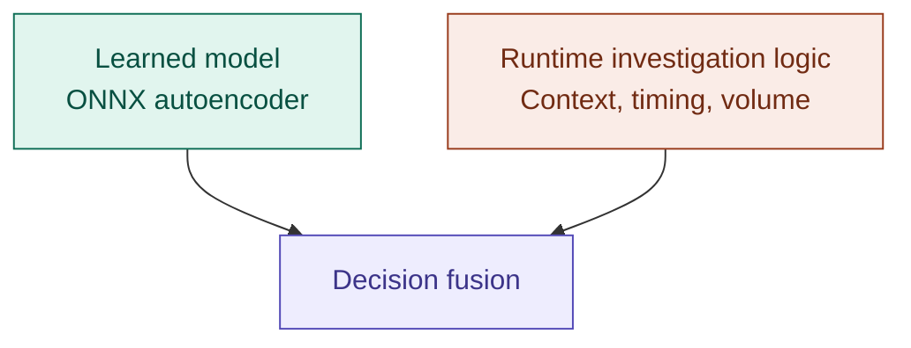

# Development Transparency — Local AI Guardian

This document exists to be transparent about how Local AI Guardian was built: which tools were involved, what each one was used for, and where responsibility for the engineering decisions ultimately sat. It is referenced from the main `README.md` and is meant to be readable on its own.

---

# 1. Purpose of This Document

AI-assisted development tools were used throughout this project, alongside conventional tools for model development, deployment, and version control. Rather than leaving that implicit, this document lays out exactly how each tool contributed, so the development process can be understood, questioned, and reproduced.

---

# 2. Tools Used and Their Roles

The tools below are grouped by the role they played, rather than listed as a single flat table.

### 2.1 Reasoning, review & documentation

| Tool | Role |
| ---- | ---- |
| **ChatGPT** | Architecture discussion, engineering reasoning, debugging, code review, documentation, and deployment planning |

### 2.2 Model development

| Tool | Role |
| ---- | ---- |
| **Python / PyTorch** | Model development and experimentation |
| **ONNX / ONNX Runtime** | Model export, deployment, and local inference |

### 2.3 Deployment & validation

| Tool | Role |
| ---- | ---- |
| **Google Colab** | Model conversion/export, ONNX validation, and deployment experiments |
| **Qualcomm AI Hub** | Snapdragon-targeted compilation, profiling, and inference validation |

### 2.4 Environment & repository

| Tool | Role |
| ---- | ---- |
| **JuiceMind** | Earlier development and testing environment for the OT Guardian prototype |
| **GitHub** | Final source-code and documentation repository |

---

# 3. Development and Deployment Boundary

The deployed Guardian keeps the learned model and the runtime investigation logic as two separate pieces that only meet at decision fusion:

*(Mermaid code block — edit the text directly to relabel or restructure it.)*

At runtime, Guardian:

1. Encodes an OT communication event into its original 18-feature representation.
2. Runs the deployed autoencoder through ONNX Runtime and calculates the reconstruction error.
3. Combines that AI result with contextual, temporal, and communication-volume investigations.
4. Produces a single fused result for a human to review.

This deployed system carries forward the same safety boundary described in the main README:

| Guardian can | Guardian does not |
| ------------- | ------------------ |
| 1. Observe | 1. Block network traffic |
| 2. Analyse | 2. Modify PLC configuration |
| 3. Investigate | 3. Modify the industrial process |
| 4. Explain | 4. Shut down equipment |
| 5. Alert | 5. Control OT devices |
| | 6. Automatically take corrective action |

This separation — learned model on one side, human-auditable investigation logic on the other, meeting only at decision fusion — is intended to keep the deployed system understandable, reproducible, and suitable for environments where operational availability and safety are critical.

---

# 4. AI Assistance Disclosure

**ChatGPT** was used as an engineering assistant throughout development. Specifically, it supported:

1. Architecture discussions — reasoning through design options for Guardian's detection pipeline.
2. Debugging — narrowing down the cause of unexpected runtime or model behaviour.
3. Implementation reasoning — weighing trade-offs between different approaches before writing code.
4. Code review — a second pass over logic before it was finalised.
5. Documentation — drafting and refining project documentation, including this file.
6. Deployment planning — thinking through the ONNX export and Snapdragon deployment workflow.

---

# 5. Division of Responsibility

AI assistance was used as a reasoning aid, not as a substitute for engineering judgment. The project author remained responsible for:

1. Selecting and defining the problem the project addresses.
2. Defining the system requirements and safety boundaries.
3. Designing and validating the overall Guardian architecture.
4. Reviewing and modifying implementation code.
5. Validating model behaviour and deployment outputs.
6. Testing the system and investigating unexpected results.
7. Making final engineering and implementation decisions.

> Responsibility for the project's design, implementation, validation, and final decisions remained with the project author throughout.

---

# 6. Summary

AI-assisted tools, model-development tools, and deployment-validation tools each played a distinct, disclosed role in building Local AI Guardian. None of them replaced the engineering judgment required to define the problem, set the safety boundary, or validate that the deployed system behaves as intended — that responsibility stayed with the project author from start to finish.
